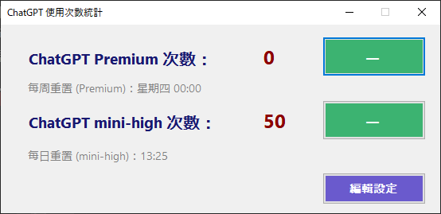
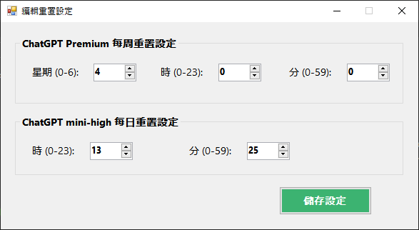

# ChatGPT Usage Counter

📊 一個簡潔實用的 Windows 桌面應用程式，用於統計與管理 ChatGPT 使用次數。支援 ChatGPT Premium（每週重置）與 ChatGPT mini-high（每日重置）兩種用量追蹤模式，並可自訂重置時間設定。

## 📦 功能特色

- 🔢 記錄 ChatGPT Premium 每週可用次數（預設 50 次）
- 🔁 記錄 ChatGPT mini-high 每日可用次數（預設 50 次）
- 🕒 自動依據預設設定或使用者自訂的時間重置計數
- 💾 使用 XML (`data.xml`) 儲存所有設定與狀態
- 🧑‍💻 可透過介面修改重置時間設定（含星期、時、分）
- 🎨 直觀且精簡的使用者介面，使用 .NET Windows Forms 製作

## 🖥️ 畫面截圖

| 主視窗                             | 設定視窗                                     |
|:-------------------------------:|:----------------------------------------:|
|  |  |

## 🛠️ 使用技術

- 語言：C# (.NET Framework)
- 技術架構：Windows Forms
- 資料儲存：XML (`data.xml`)
- 介面語言：繁體中文

## 🧰 專案結構

```
ChatGPTUsageCounter/
├── frmMain.cs              # 主視窗邏輯（統計與操作次數）
├── frmMain.Designer.cs     # 主視窗介面元件
├── frmEditXML.cs           # 設定編輯視窗邏輯
├── frmEditXML.Designer.cs  # 設定編輯視窗元件
├── ChatGPTUsageCounter.csproj
└── data.xml (執行時自動產生)
```

## ⚙️ 如何使用

1. 使用 Visual Studio 開啟本專案（`ChatGPTUsageCounter.csproj`）
2. 建立並執行應用程式
3. 點擊：
   - 「－」按鈕：扣除一次使用次數（Premium 或 mini-high）
   - 「編輯設定」：開啟視窗修改重置時間
4. 程式會自動每分鐘檢查是否需重置次數

### 預設重置時間

| 模式                | 重置週期 | 預設時間      |
| ----------------- | ---- | --------- |
| ChatGPT Premium   | 每週   | 星期二 15:29 |
| ChatGPT mini-high | 每日   | 10:00 AM  |

> 所有設定會保存在 `data.xml`，首次啟動時會自動建立。

## 🧪 注意事項

- 每次關閉程式會記錄上次關閉時間，以便下次啟動時自動判斷是否需要重置。
- 若發生 XML 讀取錯誤，將自動重新建立預設檔案。

## 📝 授權 License

本專案採用 [MIT License](LICENSE) 授權。  
你可以自由使用、修改、散佈本程式碼，包含用於商業用途，但必須保留原始授權條款與版權聲明。
